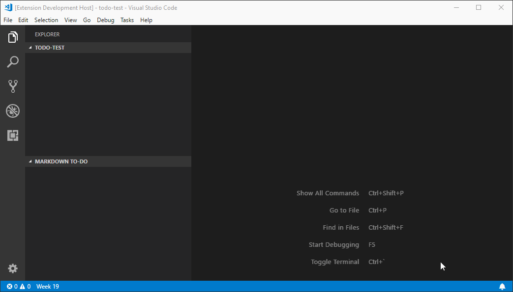

# VSCode MarkDown To-Do

Collects to-do items in MarkDown files to an Explorer tree view with contextual menues for toggling and removing to-do items and keeps the tree view up-to-date as to-do items are inserted, updated and deleted in any MarkDown file in the workspace.

## Release Notes

See the [CHANGELOG](CHANGELOG.md).

## Contributing

See [todo](todo).
